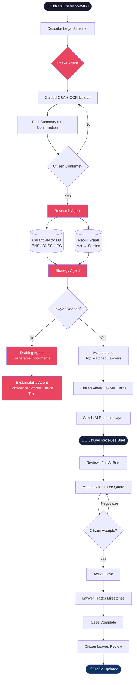
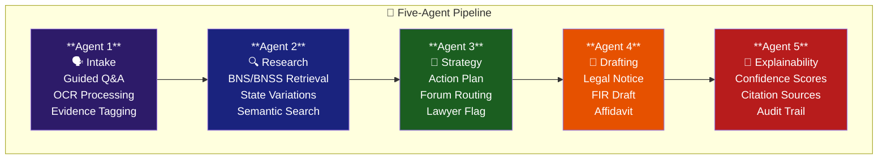
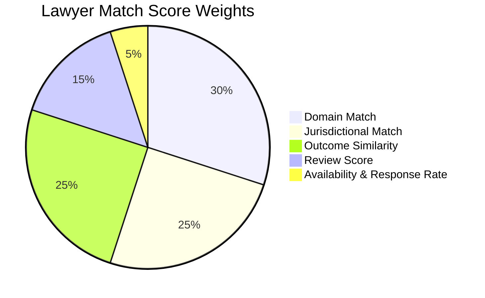
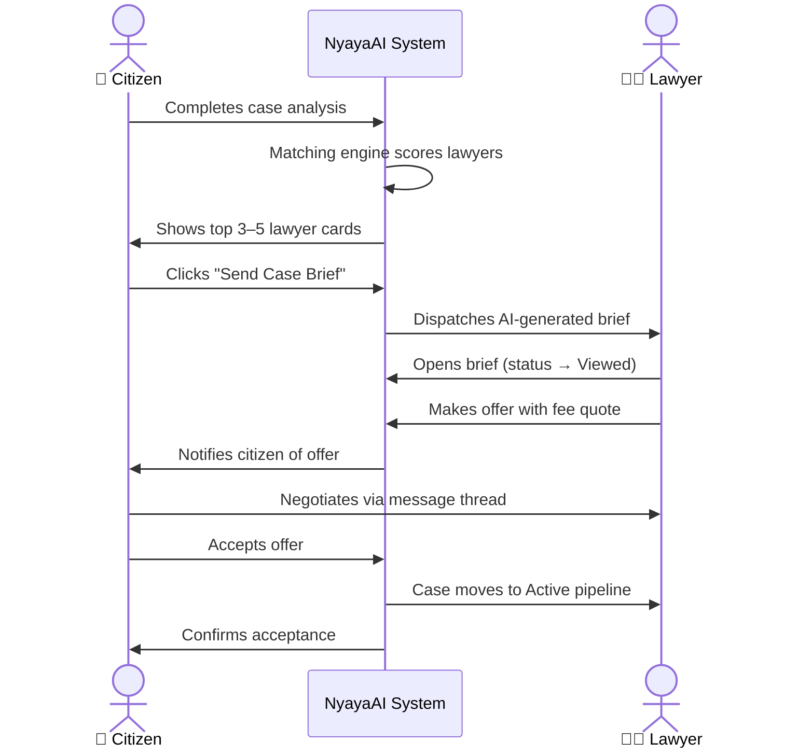
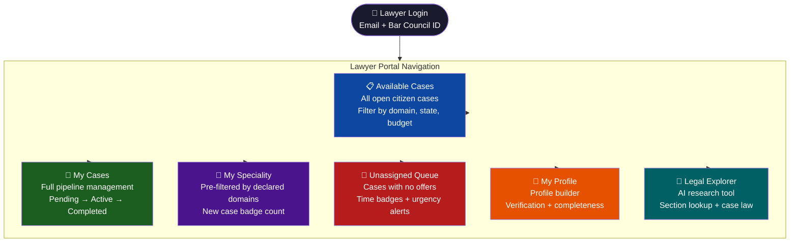
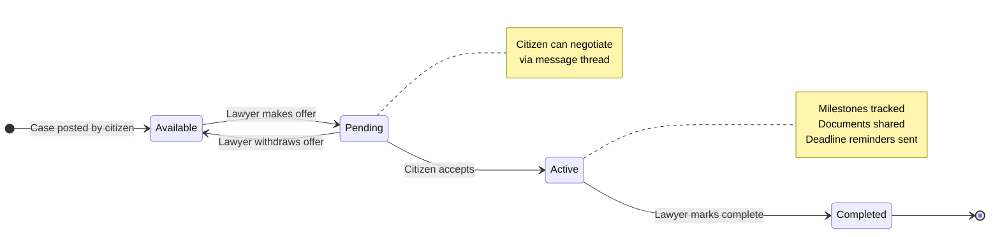
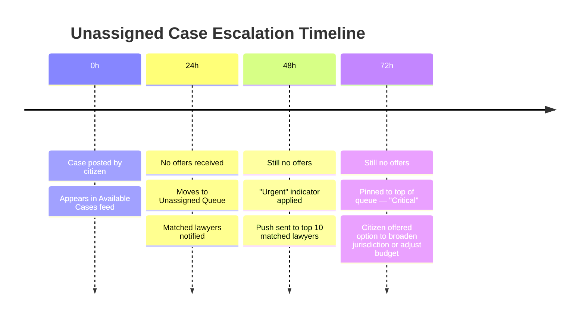
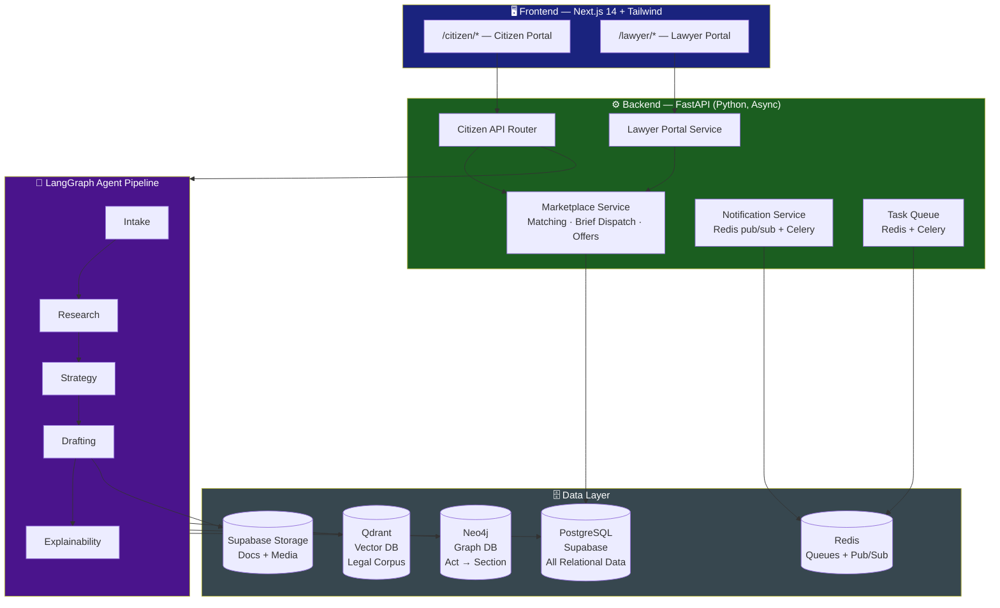
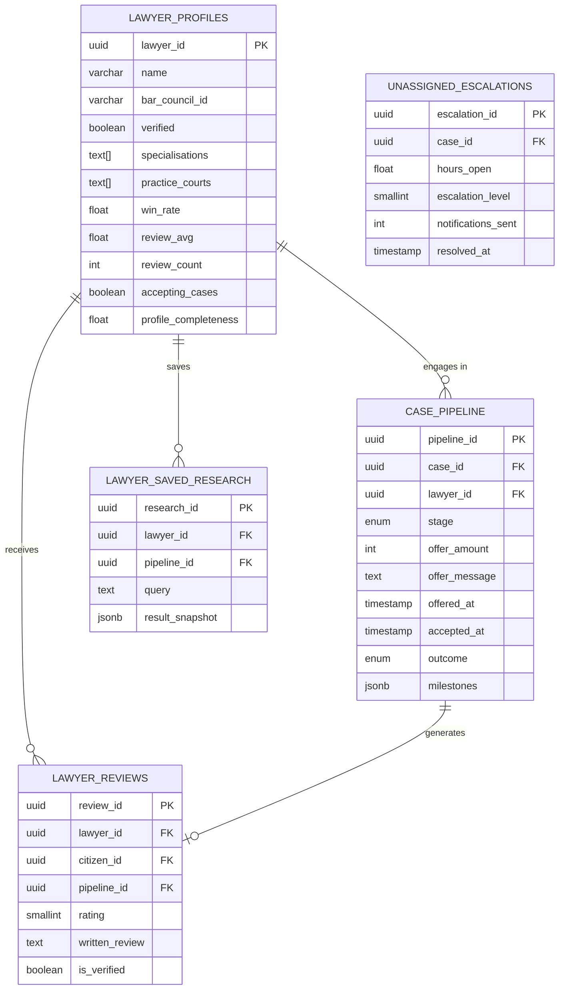

# ⚖️ NyayaAI

> **Intelligent Legal Assistance for Every Indian Citizen**
> 
> *Production-grade · 5-Agent Pipeline · Dual-Side Marketplace · BNS / BNSS / IPC / CPC / CrPC*

---

## 📋 Table of Contents

- [What is NyayaAI?](#what-is-nyayaai)
- [The Problem](#the-problem)
- [How It Works](#how-it-works)
- [The 5-Agent Pipeline](#the-5-agent-pipeline)
- [Dual-Side Marketplace](#dual-side-marketplace)
- [Lawyer Portal](#lawyer-portal)
- [System Architecture](#system-architecture)
- [Data Model](#data-model)
- [Tech Stack](#tech-stack)
- [Build Phases](#build-phases)
- [Success Metrics](#success-metrics)
- [Roadmap](#roadmap)

---

## What is NyayaAI?

NyayaAI is a **multi-agent legal platform** that gives Indian citizens instant access to verified legal guidance — and connects them to real lawyers through a transparent marketplace.

| | |
|---|---|
| **Version** | v4.0 — Full Dual-Side Marketplace |
| **Platform** | Web App + Mobile PWA |
| **Languages** | Hindi · English · Hinglish |
| **Legal Corpus** | BNS · BNSS · IPC · CrPC · CPC |
| **Status** | Final — Ready for Development |

### What's New in v4.0

- 🧑‍💼 **Lawyer Dashboard** — Full professional portal for advocates
- 📋 **Available Cases Feed** — Lawyers browse open citizen cases
- 🔄 **Case Pipeline** — Pending → Offered → Active → Completed
- 🎯 **Speciality Feed** — Cases matched to declared domains
- 🚨 **Unassigned Queue** — Prevents cases from going stale
- 🔬 **Lawyer Legal Explorer** — Professional AI research tool

---

## The Problem

### Citizen Side
- Legal info is **fragmented** across hundreds of acts and state-level variations
- India's 2023 criminal law overhaul (IPC → BNS, CrPC → BNSS) left most resources outdated
- Professional consultation costs **₹2,000–₹10,000+** — out of reach for most
- Lawyer discovery is **100% word-of-mouth** — opaque and geographically limited

### Lawyer Side
- District court advocates have **no digital channel** to reach clients
- Cases arrive **cold** — no context, wasting the first consultation on intake
- No tool to research **BNS/BNSS alongside legacy IPC/CrPC**
- Junior lawyers outside metros struggle with **unpredictable client acquisition**

### The Gap

| Gap | NyayaAI Solution |
|-----|-----------------|
| Lawyers invisible outside personal networks | Verified marketplace with AI matching |
| Citizens arrive without context | AI brief dispatched before first contact |
| No fee transparency | Fee ranges + in-platform negotiation |
| No BNS/BNSS research tool for lawyers | Legal Explorer with full corpus |
| District lawyers have no lead pipeline | Available Cases feed filtered by speciality |

---

## How It Works

### Complete End-to-End Flow



---

## The 5-Agent Pipeline

Each citizen case passes through five specialised AI agents in sequence.



### Agent Details

| Agent | Role | v4.0 Addition |
|-------|------|--------------|
| **Intake** | Converts citizen narrative → structured JSON via guided Q&A, OCR, evidence tagging | No change |
| **Research** | Semantic retrieval from Qdrant + Neo4j — BNS/BNSS primary with state variations | Powers Lawyer Explorer with deeper citations |
| **Strategy** | Builds prioritised action plan, sets `lawyer_recommended` flag | Sets fee estimate range for posted cases |
| **Drafting** | Generates legal documents — Word + PDF export | Generates lawyer case summary card |
| **Explainability** | Confidence scores, retrieval sources, reasoning chain | Lawyer mode: full HC/SC citation text |

---

## Dual-Side Marketplace

### Matching Algorithm

The matching engine scores all available lawyers using 5 weighted factors.



### Brief Dispatch Flow



---

## Lawyer Portal

The Lawyer Portal is a **separate professional interface** — not a citizen dashboard variant. Every screen is built around the advocate's workflow.

### Portal Navigation



### Case Pipeline Stages



### Unassigned Case Escalation



### Lawyer Profile Completeness

| Section | Weight |
|---------|--------|
| Photo & Bio | 15% |
| Specialisations | 15% |
| Fee Structure | 15% |
| Case History (3+ cases) | 20% |
| Verification Badge | 20% |
| Practice Courts | 10% |
| Languages | 5% |

> ⚠️ Profiles below **60% completeness** are ranked lower in citizen search results.

---

## System Architecture



---

## Data Model

### Key Tables — v4 Additions



---

## Tech Stack

| Layer | Technology |
|-------|-----------|
| **Agent Orchestration** | LangGraph (Python) |
| **LLM** | Claude Sonnet via Anthropic API |
| **Vector DB** | Qdrant (self-hosted or Cloud) |
| **Graph DB** | Neo4j Aura Free |
| **Relational DB** | PostgreSQL via Supabase |
| **Embeddings** | text-embedding-3-large (OpenAI) |
| **OCR** | Tesseract + Claude Vision API |
| **Backend** | FastAPI (Python, async) |
| **Task Queue** | Redis + Celery |
| **Frontend** | Next.js 14 + Tailwind CSS |
| **Auth** | Supabase Auth — OTP / Bar Council ID |
| **File Storage** | Supabase Storage |
| **Document Generation** | docx (npm) · ReportLab (PDF) |
| **Deployment** | Railway (backend) · Vercel (frontend) |
| **External APIs** | IndianKanoon · eCourts · Gazette RSS |

---

## Build Phases

```mermaid
gantt
    title NyayaAI v4 — Hackathon Build Timeline
    dateFormat HH
    axisFormat Hour %H

    section Pre-Hackathon
    Lawyer portal UI (9 screens)        :done, 00, 2h
    Case pipeline schema                :done, 00, 2h
    Matching engine implementation      :done, 00, 2h
    Legal Explorer lawyer mode          :done, 00, 2h
    Escalation + alert engine           :done, 00, 2h

    section Phase 1 — Core Pipeline (0–12h)
    Wire 5 agents to live knowledge     :active, 00, 4h
    Citizen intake → analysis E2E       :04, 4h
    Lawyer matching wired to Strategy   :08, 4h

    section Phase 2 — Marketplace (12–24h)
    Brief dispatch pipeline             :12, 3h
    Case pipeline UI — Kanban stages    :15, 3h
    Lawyer Profile Builder live         :18, 2h
    Speciality feed + Unassigned Queue  :20, 4h

    section Phase 3 — Polish (24–36h)
    Full E2E demo flow                  :24, 4h
    Notifications live both sides       :28, 4h
    Performance optimisation (<45s)     :32, 4h
```

---

## Success Metrics

### Platform Quality

| Metric | Target |
|--------|--------|
| BNS/BNSS Citation Accuracy | > 98% |
| State Variation Accuracy | > 92% |
| Intake Domain Classification | > 90% |
| Analysis Pipeline Latency | < 45 seconds |

### Marketplace — Citizen Side

| Metric | Target |
|--------|--------|
| Cases surfaced to marketplace | > 45% |
| Profile view rate | > 55% |
| Brief dispatch rate | > 30% |
| Offer received within 48h | > 65% |
| Offer acceptance rate | > 50% |

### Marketplace — Lawyer Side

| Metric | Target |
|--------|--------|
| Brief response rate (within 24h) | > 70% |
| Case completion rate | > 80% |
| Review submission rate | > 40% |
| Unassigned case resolution (72h) | > 75% |
| Median profile completeness | > 80% |

---

## Roadmap


---

## User Roles

| Role | Profile | Primary Needs |
|------|---------|--------------|
| **Citizen** | No legal knowledge, Hinglish-first | Understand rights · get documents · find affordable lawyer |
| **Educated Citizen** | English-fluent, urban professional | Fast analysis · self-represent or smart lawyer selection |
| **Junior Lawyer** | 0–5 years, building practice | Client leads · AI research · profile visibility |
| **Senior Lawyer** | 5+ years, HC/SC experience | Qualified high-value leads · pre-qualified briefs |
| **Law Student / Paralegal** | Legal training background | Case research · statute lookup · outcome data |
| **Platform Admin** | Internal team | Lawyer verification · dispute resolution · quality control |

---

## Non-Goals for v4.0

> The following are explicitly **out of scope** for this version:

- ❌ Court e-filing automation
- ❌ Native mobile app (PWA only)
- ❌ Regional languages beyond Hindi / English / Hinglish
- ❌ Aadhaar-based KYC
- ❌ In-platform payment processing or escrow
- ❌ AI automation of lawyer responses on the lawyer's behalf

---

<div align="center">

**NyayaAI v4.0** · Hackathon Build · Full Dual-Side Marketplace · BNS / BNSS / IPC / CPC · 5-Agent Pipeline

*Intelligent Legal Assistance for Every Indian Citizen*

</div>
